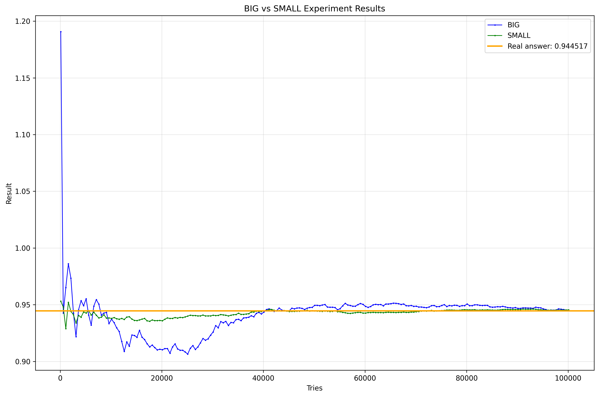
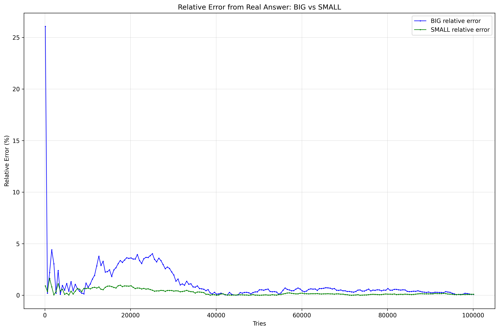

**Яковлев Александр**  
**БПИ244**  
**id посылки: 348791238**

# Отчет по заданию A1

## Структура проекта
- [`main.cpp`](main.cpp) - содержательная часть, реализация
- [`calc.py`](calc.py) - программа вычисляющая реальный ответ  
- [`exp.py`](exp.py) - программа, запускающая эксперименты
- [`plot_csv.py`](plot_csv.py) - программа строит графики
- [`real_answer.txt`](real_answer.txt) - точный ответ (аналитический)
- [`results/`](results/) - .csv файлы с результатами вычислений
- [`screens/`](screens/) - .png файлы с построенными графиками

## Задание
Рассчитать площадь пересечения трех окружностей

## Решение
Используем метод Монте-Карло: обозначим прямоугольник, в который будем произвольно кидать точки. Посчитаем долю точек, которые попали во все 3 окружности, и домножим на общую площадь прямоугольника.

## Результаты экспериментов

На графике видно два эксперимента:
- **BIG** - с большим прямоугольником
- **SMALL** - с маленьким прямоугольником

SMALL эксперимент явно лучше сходится к правильному ответу.

График показывает, как уменьшается погрешность с ростом количества точек.

## Основные выводы

Как и ожидалось, до определенного момента (~40000 точек) увеличение количества дает существенный прирост к точности. Чтобы добиться действительно хорошей точности, нужно либо много точек, либо умно выбрать прямоугольник.

Уменьшение размера прямоугольника дает заметный буст к точности - это логично, потому что при том же количестве точек покрытие области пересечения становится плотнее.

**Практический результат:** При 50,000 точках и правильно выбранном прямоугольнике получаем точность до 3-го знака после запятой.